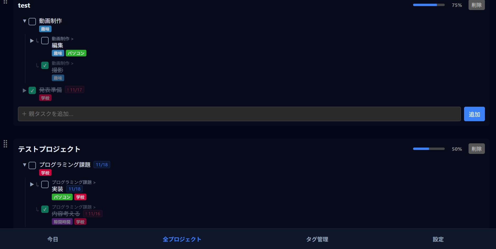
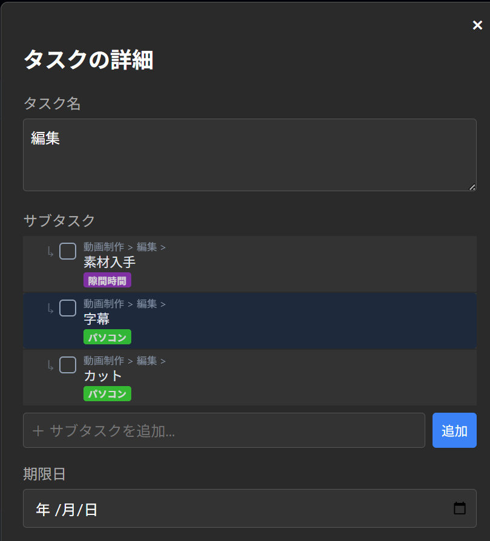
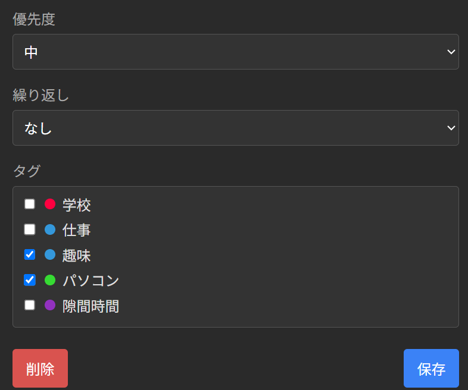
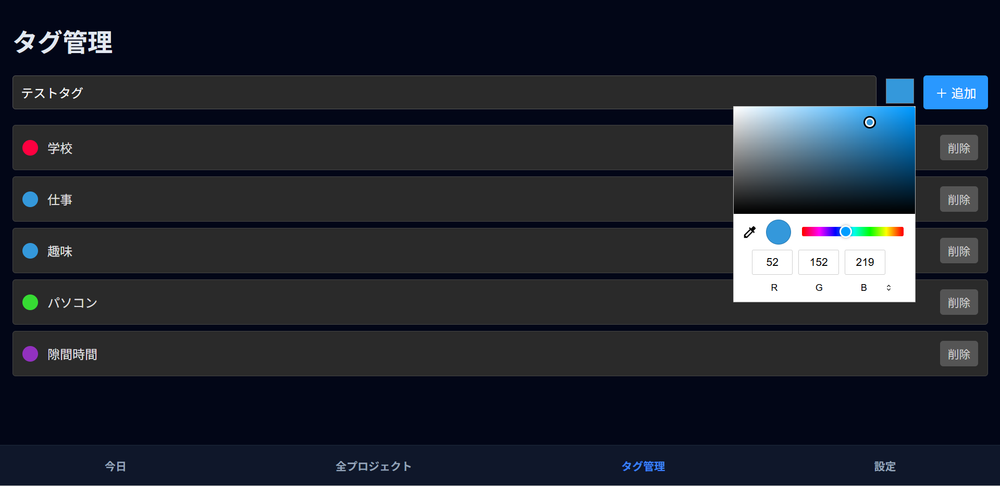
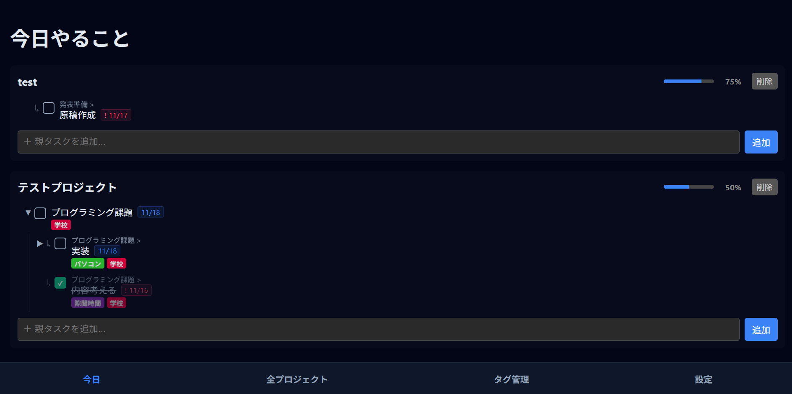
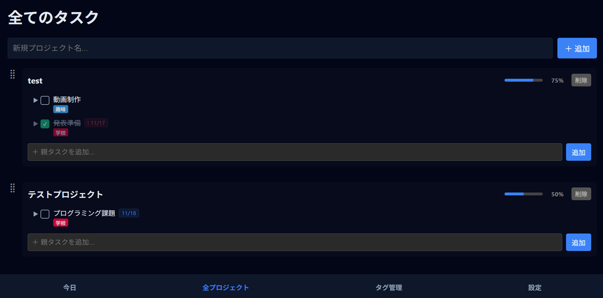

| リンク |
| :--- |
| **GithubPages:** $\rightarrow$ [https://kuroma514.github.io/todo-app/](https://kuroma514.github.io/todo-app/) |

---

## 1. 概要

このアプリケーションは、複雑なプロジェクトを**無制限の階層構造**を持つタスクに細分化し、計画的な完了を通じてユーザーの**モチベーション向上**を支援する高機能な Todo アプリケーションです。

技術面では、**React**と**TypeScript**を採用し、データ永続化には**サーバーレス**かつ**高速**なブラウザのLocal Storageのみを利用しています。これにより、ユーザーは安全かつ迅速にタスク管理を行うことができます。

---

## 2. 主な機能

### 2.1. プロジェクトおよび階層化タスク管理

  

* **プロジェクト単位での管理**: 最も大きな単位としてプロジェクトがあり、そこにタスクを追加・集約できます。
* **無限階層化タスク**: 親・子・孫...と、タスクに対してサブタスクを**無制限**に作成・管理できます。
* **ドラッグ＆ドロップ (D&D)**: `@hello-pangea/dnd` を採用し、プロジェクトや多階層タスクの並び替えを直感的に操作できます。

  

* **進捗の可視化**: タスクの完了状況に応じたプロジェクトごとの進捗バー（％）表示。

### 2.2. 高度なタスク設定

  

  

* **サブタスクの管理**: 詳細画面から、各タスクの子タスクを直接管理できます。
* **期限日の設定**: カレンダーからの日程設定に対応。
* **優先度**: 高・中・低の三段階設定。
* **習慣化（ルーティン）**: 「毎日」「平日のみ」などの繰り返し設定。進捗は翌日自動でリセットされます。

  

* **タグ管理**: カラータグを作成し、タスクに複数割り当て可能。

### 2.3. ビューモードとデータ管理

  

* **今日やること**: 期限が今日/期限切れ/今日の習慣タスクのみを自動抽出し、**今日確実に行うべきタスク**を一覧表示します。階層構造を維持しつつ、子タスクのみが該当する場合も親タスクを判別できる表示ロジックを実装しています。
* **全プロジェクト**: すべてのタスクを俯瞰し、整理・計画を行うためのビュー。

  

* **データバックアップ**: JSON形式でのエクスポート・インポート機能により、データの移行やバックアップを可能にします。

---

## 3. 技術スタック

| カテゴリ | 技術要素 |
| :--- | :--- |
| **Frontend** | React (v18), TypeScript (型安全性、保守性) |
| **Styling** | styled-components (コンポーネント指向のスタイル) |
| **State Management** | React Context API + Custom Hooks (スケーラブルな状態管理) |
| **Routing** | React Router |
| **Drag & Drop** | @hello-pangea/dnd |
| **Storage** | LocalStorage (サーバーレスなデータ永続化) |

---

## 4. 特に工夫した点

### 4.1. 多階層タスクにおける D&D の UX/パフォーマンスへの対応

本アプリケーションのコア機能である**無限階層タスク**と**直感的なドラッグ＆ドロップ（D&D）**の両立は、技術的な主要課題でした。複雑な多階層構造（親子関係）を持つアイテムをスムーズに操作できるように、UXとパフォーマンスに焦点を当てて実装を行いました。

#### 課題と解決策

1.  **無限階層 D&D の実現:**
    * **課題:** ネイティブの D&D ライブラリはフラットなリスト操作を前提としており、ドロップ時にアイテムの親子関係を正確に処理することが困難でした。
    * **解決:** `Droppable` コンポーネントを再帰的に配置し、ドロップ時に、どの `Droppable`（＝親タスク）にドロップされたかを判定するロジックを実装しました。これにより、異なる階層へのD&Dを防ぎ、判定を吸われることなくストレスフリーな操作ができるようにしました。

---

## 5. 開発情報

* **開発期間**: 2025.10.23 〜 2025.11.18 (約 20 時間)
