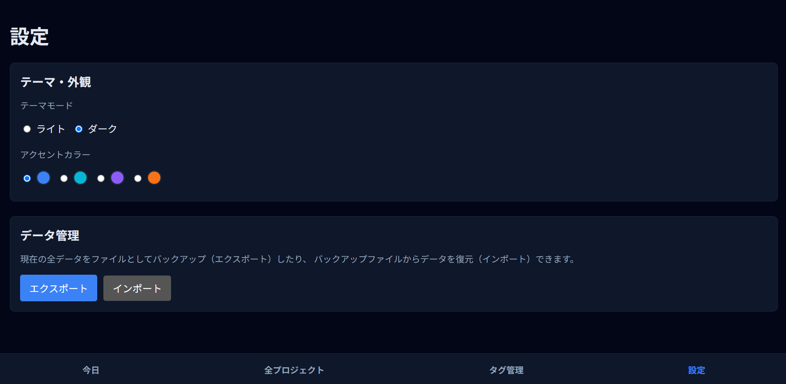

本アプリをホストするGithubPagesのリンク
https://kuroma514.github.io/todo-app/

## 概要

プロジェクトを細かなタスクに細分化し、一つずつ完了させる達成感をもとに、モチベーション向上を目指す todo アプリです。
React と TypeScript を使用し、データは全てブラウザのローカルストレージに保存されるため、サーバー不要で高速・安全に動作します。

## 機能

### 1.タスク管理

  

- **プロジェクト単位での管理**:最も大きな単位としてプロジェクトがあり、そこにタスクを追加していくことができる。

- **階層化タスク**: 親・子・孫...と無制限にタスクに対して更にそれを細分化したサブタスクを作成可能。

- **ドラッグ＆ドロップ**: `@hello-pangea/dnd` を採用し、プロジェクトやタスクの並び替えを直感的に操作可能。

  

- **進捗の可視化**: タスクの完了状況に応じたプロジェクトごとの進捗バー（％）表示。

### 2.タスクの詳細

  

  

- **サブタスクの管理**: この画面から、各タスクの子タスクの管理を行える。
- **期限日の設定**: カレンダーから、期限となる日程を設定できる。
- **優先度**: 優先度を高・中・低の三段階で設定できる。
- **習慣化（ルーティン）**: 「毎日」 「平日のみ」などの繰り返し設定。翌日にはタスクの進捗が自動でリセットされる。

  

- **タグ管理**: カラータグを作成し、タスクに複数割り当て可能。設定画面は画像の通り。

### 3.ビューモード

  

- **今日やること**: 期限日が「今日」のタスク、期限切れタスク、今日の習慣タスクのみを自動抽出し、今日中に確実にやらなければならないものを表示する。この時、子タスクだけが提出期限の場合は、子タスクだけ表示され、親タスクがなにか分かるようになっている。

  

- **全プロジェクト**: すべてのタスクを俯瞰し、整理・計画を行うためのビュー。

## 設定画面

  

- **データバックアップ**: JSON 形式でのエクスポート・インポート機能により、データの移行やバックアップが可能。
- **テーマ変更**: ライト/ダークモードの切り替えおよびアクセントカラーの変更が可能。

## 技術スタック

- **Frontend**: React (v18), TypeScript
- **Styling**: styled-components
- **State Management**: React Context API + Custom Hooks
- **Routing**: React Router
- **Drag & Drop**: @hello-pangea/dnd
- **Storage**: LocalStorage (Custom Hook による永続化)

## 開発期間

2025.10.23 ~ 2025.11.18 (約 20 時間)
